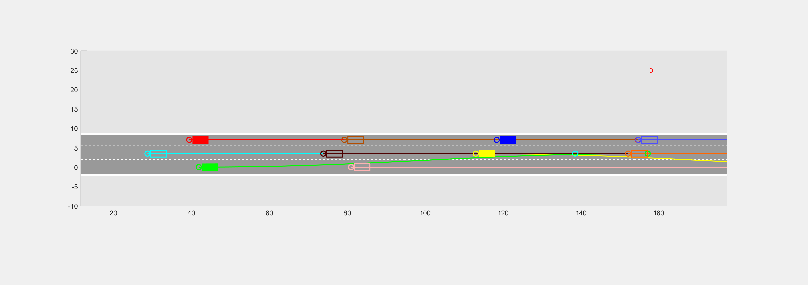

# Cooperative-Lane-Change-in-Mixed-Traffic-Environments

Coordinated decision-making and control can help Connected and Automated Vehicles (CAVs) effectively handle the uncertainty of human-driven vehicles (HDVs) and improve overall traffic throughput. This paper presents a Monte Carlo Tree Search (MCTS)–based  coordinated decision-making and control framework for CAVs in mixed traffic environments.  A probabilistic modeling approach is developed to capture HDV lane-change behavior under three different motivations: free, active, and mandatory changes. Leveraging this model, CAVs are guided to perform safe and smooth coordinated lane changes in complex scenarios such as lane bottleneck merging. To enable real-time execution under uncertainty, a rolling horizon optimization strategy is integrated with MCTS. Simulation results demonstrate the effectiveness of the proposed method in enhancing coordination and improving traffic efficiency.

### Case Study
#### 10 Vehicles and 4 CAVs 

